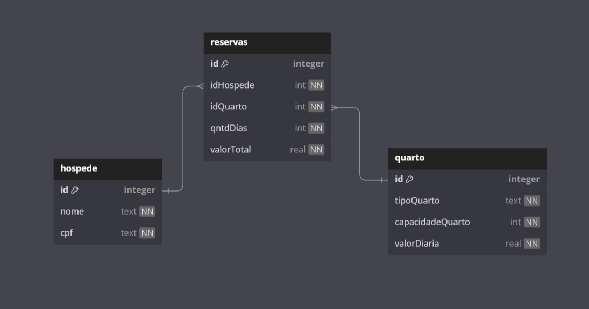

# Projeto Sistema de Hospedagem
Este é parte do meu aprendizado com Java. 
Neste projeto irei utilizar Java e SQLite para construir um sistema de hospagem que cadastra hospede, quarto e reservas.

***
### 👨🏻‍💻 Stack de Tecnologias
- Programming language - **Java (JDK 19)**
- Database - **SQLite** 
- Project management tool - **Maven**

***
### Funcionalidades:
- **1: Hospede**  
  Cadastra o Nome e o cpf. 

- **2 Quarto**  
  Cadastrar o tipo, capacidade e valor da diária do quarto.

- **3 Reserva** 
  Cadastrar uma reserva que tem tipo do quarto, hospede responsavel, dias de estadia e valor total da estadia.

